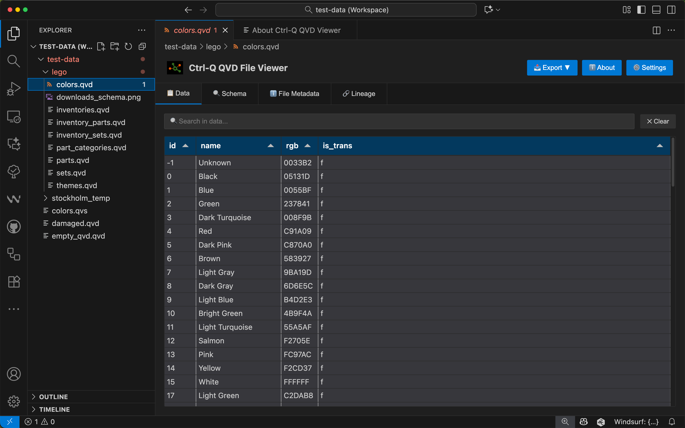
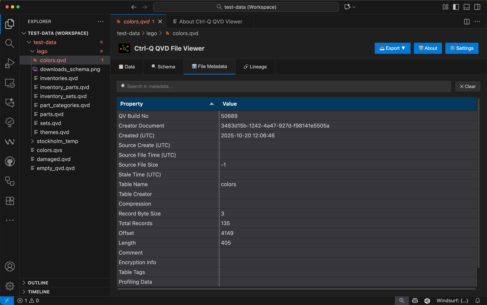
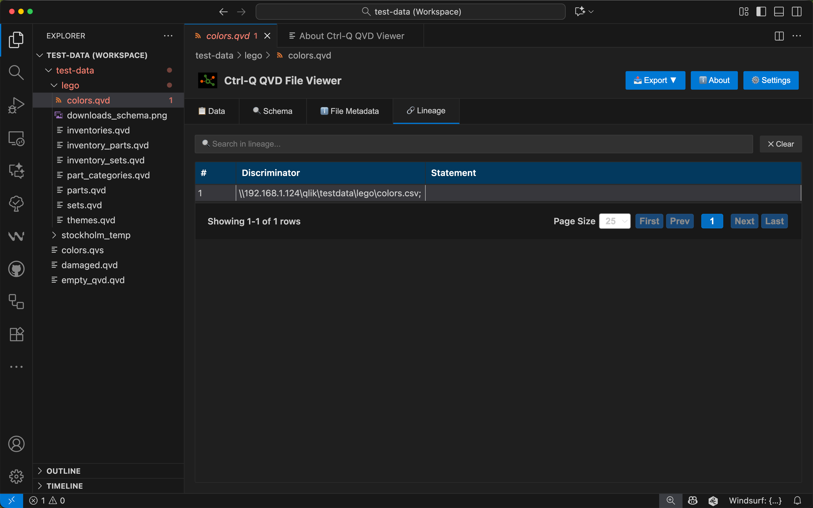
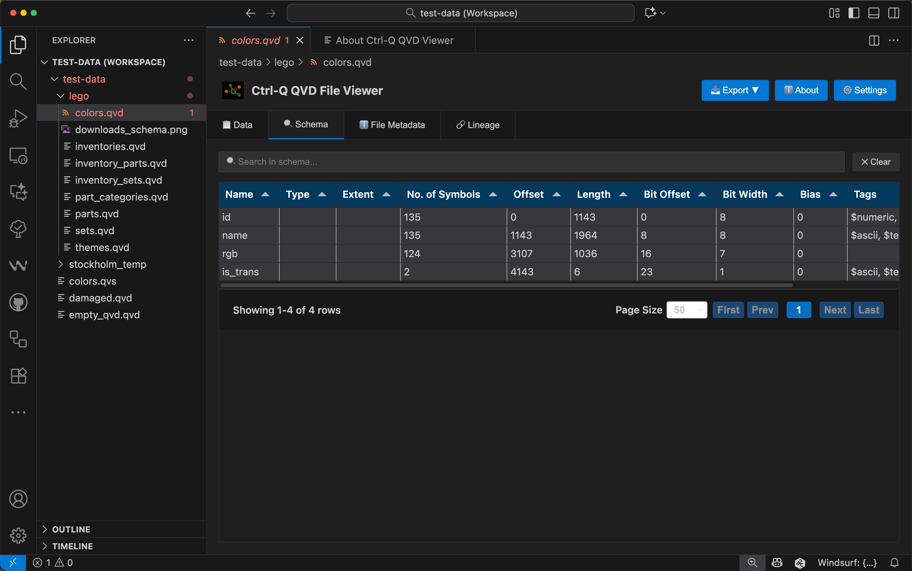
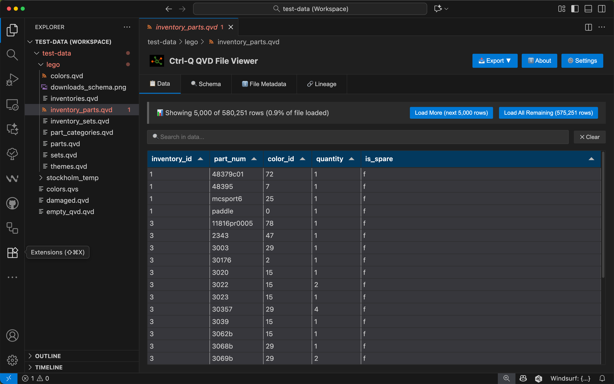

# Viewing QVD Files in VS Code: A Modern Workflow for Qlik Developers

When you're developing Qlik Sense applications, QVD files are fundamental to your data architecture. They optimize load times, enable incremental data loading, and serve as efficient storage for your data. But how often do you need to quickly check what's inside a QVD file without spinning up Qlik Sense or loading it into an app?

For developers who already work in VS Code for scripting, documentation, or other development tasks, there's now a more integrated approach: the **Ctrl-Q QVD Viewer** extension brings QVD file inspection directly into your editor.

## The Challenge with QVD Files

QVD files are excellent for what they do—fast, efficient storage of Qlik data. But inspecting them traditionally meant:

- Opening Qlik Sense and creating a temporary app
- Using standalone utilities outside your normal workflow
- Writing load scripts just to peek at the data
- Switching between multiple tools to validate data changes

If you're debugging a data issue, investigating field structures, or validating incremental loads, this context-switching adds friction to your workflow.

## What Ctrl-Q QVD Viewer Brings to VS Code

The Ctrl-Q QVD Viewer is a free, open source extension that integrates QVD file viewing directly into VS Code. Simply click on any `.qvd` file in your workspace, and the extension displays:

### File and Field Metadata

Every QVD file contains metadata about its creation and structure. The extension displays:

- Creator document name and creation timestamp
- Total record count
- Field definitions with data types (INTEGER, TEXT, TIMESTAMP, etc.)
- Symbol counts and storage details for each field

This metadata is valuable when you're tracking down data lineage issues or understanding how a QVD was generated.

### Data Lineage Information

When QVD files include lineage information, the extension displays it in a dedicated tab. This helps you trace data back to its source:

### Schema Exploration

The schema tab provides a detailed view of field structures, helping you understand data types and field relationships:

### Data Preview with Pagination

The extension loads data for preview with configurable pagination. By default, it loads 5,000 rows (adjustable from 100 to 100,000), allowing you to browse through larger datasets efficiently:

This read-only viewing mode ensures your source QVD files remain unchanged while you inspect them.

## Export to Multiple Formats

One of the most powerful features is the ability to export QVD data to 11 different formats:

- **Apache Arrow** - High-performance columnar format for analytics
- **Avro** - Compact binary format with schema evolution support
- **CSV** - Universal compatibility with Excel and data tools
- **Excel** - Native .xlsx format with styled headers
- **JSON** - Structured format for web applications and APIs
- **Parquet** - Efficient columnar storage for big data platforms
- **Qlik Sense Inline Script** - Generate load scripts with inline data tables
- **PostgreSQL** - Database export with CREATE and INSERT statements
- **SQLite** - Self-contained database files
- **XML** - Structured markup for enterprise systems
- **YAML** - Human-readable configuration format

This flexibility means you can move QVD data into other analysis tools, share it with team members who don't use Qlik, or integrate it into different data pipelines without writing custom extraction code.

## Real-World Use Cases

### Debugging Data Issues

Imagine you're investigating why certain records aren't appearing in your Qlik app. Instead of loading the QVD into Qlik Sense, you can:

1. Open the QVD file in VS Code
2. Verify the record count in the metadata
3. Browse the data preview to spot anomalies
4. Check field types to ensure they match expectations

All without leaving your development environment.

### Data Validation in CI/CD

If you're using QVD files as part of an automated data pipeline, you can now validate them programmatically:

1. Open and inspect QVDs in VS Code during development
2. Export sample data for unit tests
3. Verify field structures match your specifications
4. Check lineage information to confirm data sources

### Cross-Platform Data Sharing

When you need to share data with colleagues who work in Python, R, or other analytics platforms:

1. Open the QVD file
2. Export to Parquet, Arrow, or CSV
3. Share the exported file

The export includes all rows from the QVD, not just the preview data, ensuring complete data transfer.

### Generating Qlik Load Scripts

The Qlik Inline Script export is particularly useful when you need to create sample data for testing:

1. Export a QVD to inline script format
2. Select the number of rows (10, 100, 1,000, or custom)
3. Copy the generated script into your Qlik app
4. You now have a self-contained inline table for testing

## Getting Started

Installing and using the extension takes just a few minutes:

1. **Install from VS Code Marketplace**
   - Open VS Code Extensions panel (`Ctrl+Shift+X`)
   - Search for "Ctrl-Q QVD Viewer"
   - Click Install

2. **Open a QVD File**
   - Click on any `.qvd` file in your workspace
   - The file opens automatically in the QVD viewer

3. **Configure Display Settings** (Optional)
   - Go to Settings (`Ctrl+,`)
   - Search for "Ctrl-Q QVD"
   - Adjust the maximum preview rows if needed

That's it. No complex configuration, no separate tools to install.

## Part of the Butler Family

Ctrl-Q QVD Viewer is part of the Butler family of open source tools for Qlik Sense and QlikView, all sponsored by Ptarmigan Labs:

- **Butler** - Core monitoring and automation for Qlik Sense Enterprise
- **Ctrl-Q** - Command-line tool for Qlik Sense administration and DevOps
- **Butler SOS** - Real-time monitoring and metrics
- **Butler CW** - Cache warming utility

These tools share a common philosophy: make Qlik Sense operations more efficient through automation, better visibility, and modern development practices.

## Why It Matters

The Ctrl-Q QVD Viewer doesn't replace Qlik Sense—it complements your workflow by removing friction from common tasks. When you need to quickly inspect a QVD file, validate data changes, or export data for analysis elsewhere, you can do so without switching contexts.

For developers already working in VS Code for script development, documentation, or version control, having QVD viewing integrated into the same environment means one less tool to manage and one less reason to break focus.

The extension is open source, free to use, and part of a broader ecosystem of tools designed to make Qlik development more efficient. Whether you're debugging a data issue at 3 PM or validating an incremental load at midnight, having quick access to QVD contents can save valuable time.

## Try It Yourself

Ready to streamline your QVD workflow? Install the Ctrl-Q QVD Viewer from the [VS Code Marketplace](https://marketplace.visualstudio.com/items?itemName=ptarmiganlabs.qvd-viewer) and give it a try with your own QVD files.

The source code is available on [GitHub](https://github.com/ptarmiganlabs/ctrl-q-qvd-viewer), and we welcome contributions, bug reports, and feature suggestions from the community.

---

*Learn more about the Butler family of tools at [ptarmiganlabs.com/the-butler-family](https://ptarmiganlabs.com/the-butler-family)*
