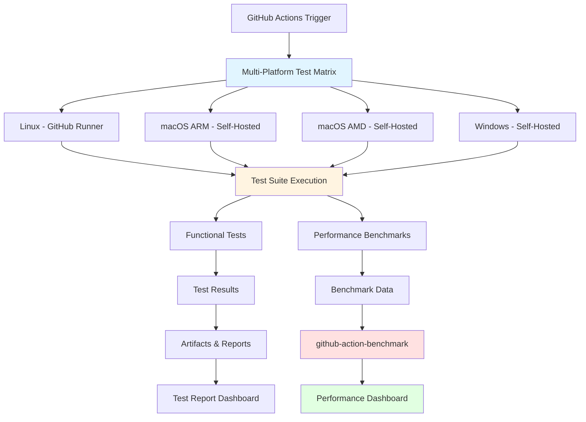
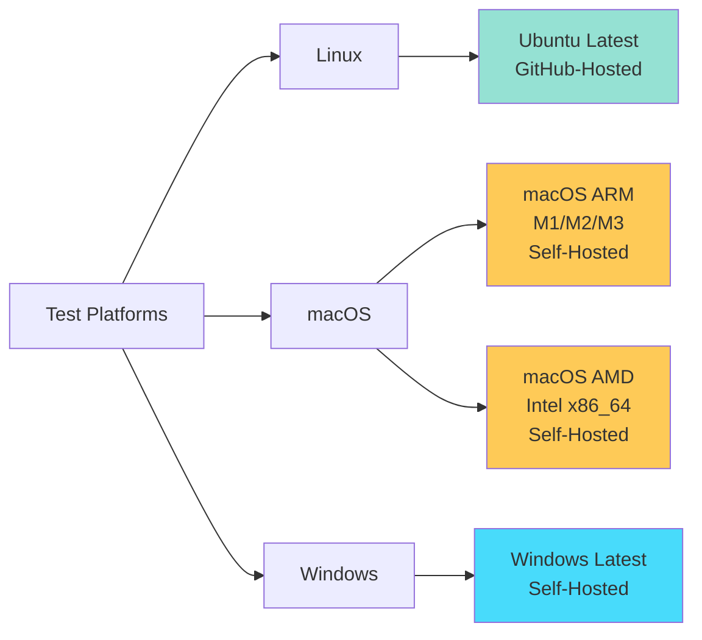
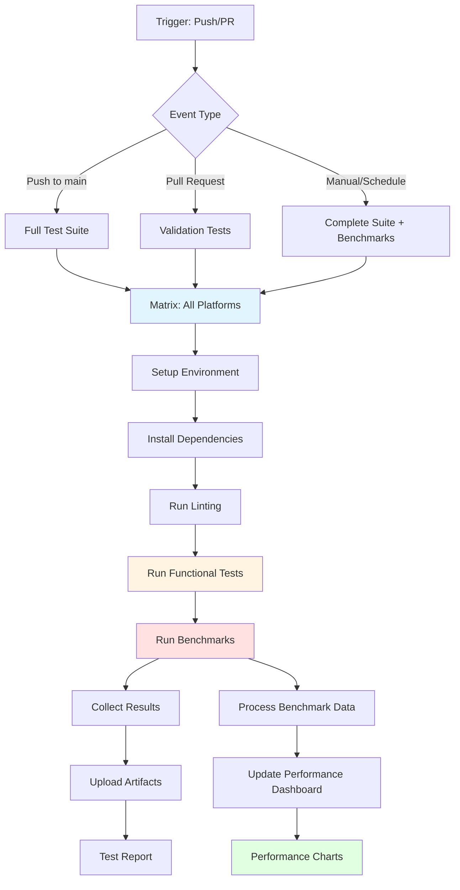
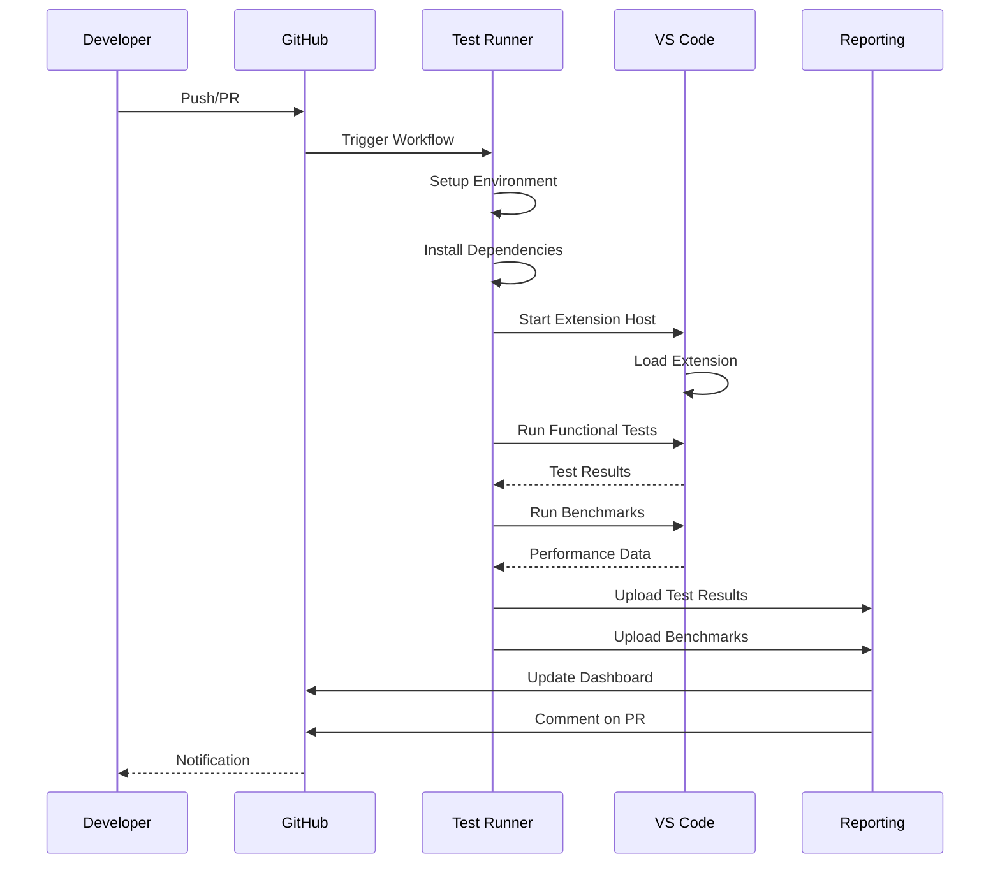

# Multi-Platform Testing Solution for Ctrl-Q QVD Viewer

## Overview

This document describes the comprehensive automated testing solution for the Ctrl-Q QVD Viewer VS Code extension. The solution provides end-to-end testing across Windows, macOS, and Linux platforms with performance tracking and regression detection.

## Table of Contents

- [Architecture](#architecture)
- [Test Coverage](#test-coverage)
- [Platform Strategy](#platform-strategy)
- [Performance Benchmarking](#performance-benchmarking)
- [Implementation Components](#implementation-components)
- [GitHub Actions Workflow](#github-actions-workflow)
- [Runner Requirements](#runner-requirements)
- [Test Execution Flow](#test-execution-flow)
- [Performance Tracking](#performance-tracking)
- [Maintenance and Monitoring](#maintenance-and-monitoring)
- [Troubleshooting](#troubleshooting)

## Architecture

The testing solution consists of four main components:



### Component Responsibilities

1. **GitHub Actions Workflow**: Orchestrates test execution across all platforms
2. **Test Suite**: Contains functional and performance tests
3. **Benchmark Suite**: Measures performance metrics using tinybench
4. **Reporting System**: Collects and displays results via github-action-benchmark

## Test Coverage

### Functional Tests

The test suite validates the following functionality:

#### 1. Extension Installation
- ✅ Extension activates successfully
- ✅ Commands are registered correctly
- ✅ Custom editor provider is registered
- ✅ Extension manifest is valid

#### 2. Metadata Loading
- ✅ QVD file XML header is parsed correctly
- ✅ Field information is extracted (names, types, symbols)
- ✅ File metadata is retrieved (creator, date, record count)
- ✅ Error handling for corrupt/invalid files

#### 3. Initial Data Loading
- ✅ Limited row set loads correctly (default: 5000 rows)
- ✅ Data matches expected structure
- ✅ Columns are correctly identified
- ✅ Configuration setting for maxPreviewRows is respected

#### 4. Load More Functionality
- ✅ Additional data can be loaded on demand
- ✅ Pagination works correctly
- ✅ Performance remains acceptable with large files
- ✅ UI updates with new data

#### 5. Cross-Platform Compatibility
- ✅ File paths work correctly on all platforms
- ✅ Line endings handled properly
- ✅ Character encoding is consistent
- ✅ UI rendering is correct on all platforms

### Performance Benchmarks

Performance tests measure:

1. **Extension Activation Time**
   - Cold start performance
   - Warm start performance

2. **Metadata Parsing Speed**
   - Small files (< 1 MB)
   - Medium files (1-10 MB)
   - Large files (> 10 MB)

3. **Data Loading Performance**
   - Initial load (first N rows)
   - Pagination load (subsequent pages)
   - Memory usage patterns

4. **UI Rendering Time**
   - Webview initialization
   - Data table rendering
   - Scroll performance

## Platform Strategy

### Operating Systems Coverage



### Runner Configuration

| Platform | Runner Type | Runner Tags | VS Code Support | Node.js Version |
|----------|-------------|-------------|-----------------|-----------------|
| Linux | GitHub-hosted | `ubuntu-latest` | ✅ Full | 22.x |
| macOS ARM | Self-hosted | `macos-arm64` | ✅ Full | 22.x |
| macOS AMD | Self-hosted | `macos-x64` | ✅ Full | 22.x |
| Windows | Self-hosted | `windows-latest` | ✅ Full | 22.x |

### Why Self-Hosted for Windows and macOS?

1. **Performance**: Faster execution times
2. **Consistency**: Controlled environment
3. **Cost**: More economical for frequent runs
4. **Capabilities**: Better hardware support for UI testing
5. **Availability**: More concurrent job capacity

### Display Server Requirements

| Platform | Display Server | Setup Required |
|----------|----------------|----------------|
| Linux | Xvfb (Virtual) | ✅ Yes - `apt-get install xvfb` |
| macOS | Native | ❌ No - Uses native display |
| Windows | Native | ❌ No - Uses native display |

## Performance Benchmarking

### Benchmark Suite Implementation

We use **[tinybench](https://github.com/tinylibs/tinybench)** for performance measurements:

```javascript
// test/benchmark.test.js
import { Bench } from 'tinybench';

const bench = new Bench({ time: 1000 });

bench
  .add('Extension Activation', async () => {
    // Measure activation time
  })
  .add('Metadata Parsing - Small File', async () => {
    // Parse metadata from small QVD
  })
  .add('Data Loading - 100 Rows', async () => {
    // Load initial data set
  })
  .add('Data Loading - 5000 Rows', async () => {
    // Load default preview size
  })
  .add('Pagination - Load Next Page', async () => {
    // Measure pagination performance
  });

await bench.warmup();
await bench.run();

// Export results in format compatible with github-action-benchmark
console.table(bench.table());
```

### Benchmark Categories

1. **Cold Start Metrics**
   - Extension activation from scratch
   - First file open
   - Initial webview creation

2. **Warm Performance**
   - Subsequent file operations
   - Cached data access
   - UI updates

3. **Load Testing**
   - Large file handling (100k+ rows)
   - Memory consumption
   - Concurrent file operations

### Performance Thresholds

| Metric | Target | Warning | Critical |
|--------|--------|---------|----------|
| Extension Activation | < 500ms | > 1s | > 2s |
| Metadata Parse (Small) | < 50ms | > 100ms | > 200ms |
| Initial Data Load (5k rows) | < 500ms | > 1s | > 2s |
| Pagination Load | < 200ms | > 500ms | > 1s |
| Memory Usage | < 100MB | > 200MB | > 500MB |

## Implementation Components

### 1. Enhanced Test Suite

**Location**: `test/e2e/`

```
test/
├── e2e/
│   ├── extension.test.js      # Extension installation tests
│   ├── metadata.test.js        # Metadata loading tests
│   ├── dataLoading.test.js     # Initial data loading tests
│   ├── pagination.test.js      # Load more functionality tests
│   └── platform.test.js        # Platform-specific tests
├── benchmark/
│   ├── benchmark.test.js       # Performance benchmarks
│   └── helpers.js              # Benchmark utilities
└── fixtures/
    ├── small.qvd               # < 1 MB test file
    ├── medium.qvd              # 1-10 MB test file
    └── large.qvd               # > 10 MB test file
```

### 2. Benchmark Runner

**Location**: `test/benchmark/benchmark.test.js`

Key features:
- Runs all performance benchmarks
- Outputs results in JSON format
- Compatible with github-action-benchmark
- Measures per-platform performance

### 3. GitHub Actions Workflow

**Location**: `.github/workflows/multi-platform-test.yml`

Key features:
- Matrix strategy for all platforms
- Parallel execution where possible
- Artifact collection for all platforms
- Performance data aggregation
- Benchmark visualization

### 4. Performance Dashboard

Uses **[github-action-benchmark](https://github.com/benchmark-action/github-action-benchmark)**:

- Automatic performance charts
- Regression detection
- Historical tracking
- Per-platform comparisons
- Alert on performance degradation

## GitHub Actions Workflow

### Workflow Structure



### Workflow File Structure

```yaml
name: Multi-Platform Tests

on:
  push:
    branches: [main]
  pull_request:
    branches: [main]
  workflow_dispatch:
  schedule:
    - cron: '0 2 * * *'  # Daily at 2 AM UTC

jobs:
  test:
    strategy:
      matrix:
        os:
          - runner: ubuntu-latest
            name: Linux
          - runner: [self-hosted, macos-arm64]
            name: macOS-ARM
          - runner: [self-hosted, macos-x64]
            name: macOS-Intel
          - runner: [self-hosted, windows-latest]
            name: Windows
    
    runs-on: ${{ matrix.os.runner }}
    
    steps:
      - uses: actions/checkout@v4
      - uses: actions/setup-node@v4
        with:
          node-version: '22'
          cache: 'npm'
      
      - name: Install dependencies
        run: npm ci
      
      - name: Setup display (Linux only)
        if: runner.os == 'Linux'
        run: |
          sudo apt-get update
          sudo apt-get install -y xvfb
      
      - name: Run tests
        run: |
          if [ "$RUNNER_OS" == "Linux" ]; then
            xvfb-run -a npm test
          else
            npm test
          fi
        shell: bash
      
      - name: Run benchmarks
        run: npm run benchmark
      
      - name: Upload test results
        uses: actions/upload-artifact@v4
        with:
          name: test-results-${{ matrix.os.name }}
          path: test-results/
      
      - name: Store benchmark result
        uses: benchmark-action/github-action-benchmark@v1
        with:
          name: ${{ matrix.os.name }} Benchmarks
          tool: 'benchmarkjs'
          output-file-path: benchmark-results.json
          github-token: ${{ secrets.GITHUB_TOKEN }}
          auto-push: true
          alert-threshold: '150%'
          comment-on-alert: true
          fail-on-alert: false
```

### Trigger Events

| Event | When | Test Level | Benchmarks |
|-------|------|------------|------------|
| Push to main | Every commit | Full | Yes |
| Pull Request | On PR create/update | Validation | No |
| Manual | On-demand | Full | Yes |
| Schedule | Daily at 2 AM | Full + Extended | Yes |

## Runner Requirements

### Self-Hosted Runner Setup

#### Prerequisites

All self-hosted runners must have:

1. **Operating System**
   - Windows: Windows 10/11 or Windows Server 2019+
   - macOS: macOS 11+ (Big Sur or later)

2. **Software**
   - Git 2.x or later
   - Node.js 22.x
   - npm 11.x or later
   - VS Code (latest stable)

3. **Hardware**
   - CPU: 4+ cores recommended
   - RAM: 8 GB minimum, 16 GB recommended
   - Disk: 50 GB free space
   - Network: Stable internet connection

#### Runner Installation

**macOS (ARM/Intel)**:
```bash
# Download runner package
mkdir actions-runner && cd actions-runner
curl -o actions-runner-osx-x64.tar.gz -L \
  https://github.com/actions/runner/releases/download/vX.X.X/actions-runner-osx-x64-X.X.X.tar.gz
tar xzf ./actions-runner-osx-x64.tar.gz

# Configure
./config.sh --url https://github.com/ptarmiganlabs/ctrl-q-qvd-viewer \
  --token YOUR_TOKEN --labels macos-x64

# Install as service
sudo ./svc.sh install
sudo ./svc.sh start
```

**Windows**:
```powershell
# Download runner package
mkdir actions-runner; cd actions-runner
Invoke-WebRequest -Uri https://github.com/actions/runner/releases/download/vX.X.X/actions-runner-win-x64-X.X.X.zip `
  -OutFile actions-runner-win-x64-X.X.X.zip
Add-Type -AssemblyName System.IO.Compression.FileSystem
[System.IO.Compression.ZipFile]::ExtractToDirectory("$PWD/actions-runner-win-x64-X.X.X.zip", "$PWD")

# Configure
./config.cmd --url https://github.com/ptarmiganlabs/ctrl-q-qvd-viewer `
  --token YOUR_TOKEN --labels windows-latest

# Install as service
./svc.sh install
./svc.sh start
```

#### Runner Labels

| Platform | Required Labels |
|----------|----------------|
| macOS ARM | `self-hosted`, `macOS`, `ARM64`, `macos-arm64` |
| macOS Intel | `self-hosted`, `macOS`, `X64`, `macos-x64` |
| Windows | `self-hosted`, `Windows`, `X64`, `windows-latest` |

### GitHub-Hosted Runner (Linux)

No setup required. Uses standard `ubuntu-latest` runner with:
- Xvfb for headless testing
- Standard GitHub Actions environment

## Test Execution Flow

### Complete Test Cycle



### Test Execution Steps

1. **Environment Setup** (1-2 min)
   - Check out code
   - Install Node.js
   - Install dependencies
   - Setup display server (Linux)

2. **Linting** (10-30 sec)
   - Run ESLint on all files
   - Check for code style issues

3. **Functional Tests** (2-5 min)
   - Extension installation
   - Metadata loading
   - Data loading
   - Pagination tests
   - Platform-specific tests

4. **Performance Benchmarks** (3-5 min)
   - Extension activation
   - File parsing
   - Data operations
   - Memory profiling

5. **Results Collection** (30 sec)
   - Aggregate test results
   - Format benchmark data
   - Generate reports

6. **Artifact Upload** (30 sec - 1 min)
   - Upload test results
   - Upload benchmark data
   - Update dashboards

### Total Execution Time

| Platform | Estimated Time | Parallel Execution |
|----------|----------------|--------------------|
| Linux | 8-12 minutes | Yes |
| macOS ARM | 8-12 minutes | Yes |
| macOS Intel | 8-12 minutes | Yes |
| Windows | 10-15 minutes | Yes |
| **Total (Parallel)** | **10-15 minutes** | All platforms |

## Performance Tracking

### github-action-benchmark Integration

The solution uses **github-action-benchmark** to:

1. **Track Performance Over Time**
   - Maintains historical performance data
   - Generates trend charts
   - Detects regressions automatically

2. **Per-Platform Tracking**
   - Separate benchmarks for each OS
   - Compare performance across platforms
   - Identify platform-specific issues

3. **Regression Detection**
   - Alert when performance degrades > 50%
   - Comment on PR with performance changes
   - Fail builds on critical regressions (optional)

4. **Visualization**
   - Interactive charts via GitHub Pages
   - Per-metric breakdowns
   - Historical comparisons

### Benchmark Data Format

```json
{
  "name": "Extension Activation",
  "unit": "ms",
  "value": 450.23,
  "range": "±23.5",
  "extra": "platform=Linux, node=22.0.0"
}
```

### Performance Dashboard

Accessible at: `https://<username>.github.io/<repo>/dev/bench`

Features:
- Per-platform performance graphs
- Metric selection and filtering
- Historical trend analysis
- Regression highlights
- Export capabilities

### Alert Configuration

```yaml
alert-threshold: '150%'      # Alert if 50% slower
comment-on-alert: true       # Comment on PR
fail-on-alert: false        # Don't fail build
alert-comment-cc-users: '@ptarmiganlabs/maintainers'
```

## Maintenance and Monitoring

### Daily Monitoring Tasks

1. **Review Dashboard**
   - Check performance trends
   - Investigate any regressions
   - Compare platform performance

2. **Check Test Status**
   - Review failed tests
   - Investigate platform-specific failures
   - Monitor test flakiness

3. **Runner Health**
   - Check self-hosted runner status
   - Verify disk space
   - Review runner logs

### Weekly Maintenance

1. **Update Dependencies**
   - Run `npm update`
   - Review security advisories
   - Test compatibility

2. **Review Benchmarks**
   - Analyze performance patterns
   - Adjust thresholds if needed
   - Document significant changes

3. **Runner Maintenance**
   - Update runner software
   - Clean up disk space
   - Verify runner configuration

### Monthly Review

1. **Performance Analysis**
   - Generate performance reports
   - Identify optimization opportunities
   - Update performance goals

2. **Test Coverage**
   - Review test effectiveness
   - Add tests for new features
   - Remove obsolete tests

3. **Infrastructure**
   - Review runner costs
   - Optimize runner usage
   - Update documentation

## Troubleshooting

### Common Issues

#### Tests Fail on Specific Platform

**Symptoms**: Tests pass on some platforms but fail on others

**Solutions**:
1. Check platform-specific file paths
2. Verify display server setup (Linux)
3. Review platform-specific dependencies
4. Check for timing issues
5. Examine platform-specific logs

```bash
# View platform-specific test results
gh run view <run-id> --log-failed
```

#### Benchmarks Show High Variance

**Symptoms**: Performance metrics fluctuate significantly

**Solutions**:
1. Increase benchmark iterations
2. Add warmup phase
3. Isolate benchmark runs
4. Check system load on runners
5. Use dedicated runners for benchmarks

```javascript
const bench = new Bench({
  time: 2000,        // Run longer
  iterations: 100,   // More iterations
  warmupTime: 1000   // Warmup phase
});
```

#### Self-Hosted Runner Not Responding

**Symptoms**: Jobs queued but not starting on self-hosted runners

**Solutions**:
1. Check runner status: `./svc.sh status`
2. Restart runner: `./svc.sh restart`
3. Check runner logs: `tail -f _diag/Runner_*.log`
4. Verify network connectivity
5. Reconfigure if needed: `./config.sh remove` then reconfigure

#### Display Server Issues (Linux)

**Symptoms**: Tests fail with display-related errors

**Solutions**:
```bash
# Ensure Xvfb is installed
sudo apt-get install -y xvfb

# Run with explicit display
DISPLAY=:99 xvfb-run -a npm test

# Check if Xvfb is running
ps aux | grep Xvfb
```

#### Memory Issues with Large Files

**Symptoms**: Tests fail or slow down with large QVD files

**Solutions**:
1. Increase Node.js memory limit
2. Use streaming for large files
3. Adjust maxPreviewRows setting
4. Add cleanup between tests

```javascript
// Increase memory limit
node --max-old-space-size=4096 node_modules/.bin/vscode-test

// Cleanup between tests
afterEach(() => {
  if (global.gc) {
    global.gc();
  }
});
```

### Debug Mode

Enable verbose logging:

```yaml
- name: Run tests with debug
  run: npm test
  env:
    DEBUG: 'vscode:*'
    VSCODE_LOG: 'trace'
```

### Getting Help

1. **Documentation**: Check this guide and other docs in `/docs`
2. **Logs**: Review workflow logs in GitHub Actions
3. **Issues**: Search/create GitHub issues
4. **Community**: Reach out to maintainers

## Benefits Summary

### For Developers

- 🔍 **Confidence**: Know your changes work on all platforms
- ⚡ **Speed**: Parallel testing reduces feedback time
- 📊 **Insights**: Performance impact visible immediately
- 🛡️ **Safety**: Catch platform-specific bugs early

### For Users

- ✅ **Quality**: Thoroughly tested on their platform
- 🚀 **Performance**: Optimized experience
- 🔒 **Reliability**: Fewer bugs and issues
- 📈 **Improvement**: Continuous performance enhancements

### For Maintainers

- 🤖 **Automation**: No manual testing needed
- 📈 **Metrics**: Track performance over time
- 🎯 **Focus**: Identify real issues quickly
- 💰 **Efficiency**: Cost-effective with self-hosted runners

## Future Enhancements

### Potential Improvements

1. **Visual Regression Testing**
   - Screenshot comparison
   - UI element validation
   - Cross-platform rendering checks

2. **Extended Platform Coverage**
   - Additional Linux distributions
   - Older macOS versions
   - Windows ARM support

3. **Enhanced Benchmarking**
   - Memory profiling
   - CPU usage tracking
   - Network performance
   - Battery impact (for laptops)

4. **Test Optimization**
   - Smart test selection
   - Dependency caching
   - Incremental testing
   - Parallel test execution

5. **Better Reporting**
   - Custom dashboards
   - Slack/Teams notifications
   - Detailed performance insights
   - Trend analysis

## Conclusion

This multi-platform testing solution provides comprehensive coverage, performance tracking, and regression detection for the Ctrl-Q QVD Viewer extension. By combining functional tests, performance benchmarks, and automated monitoring, we ensure high quality across all supported platforms while maintaining development velocity.

The solution is designed to be maintainable, extensible, and cost-effective, using self-hosted runners where appropriate and leveraging GitHub's infrastructure for Linux testing.

## References

- [VS Code Extension Testing](https://code.visualstudio.com/api/working-with-extensions/testing-extension)
- [GitHub Actions Documentation](https://docs.github.com/en/actions)
- [Self-Hosted Runners](https://docs.github.com/en/actions/hosting-your-own-runners)
- [tinybench](https://github.com/tinylibs/tinybench)
- [github-action-benchmark](https://github.com/benchmark-action/github-action-benchmark)
- [Xvfb for Linux Testing](https://www.x.org/releases/X11R7.6/doc/man/man1/Xvfb.1.xhtml)

---

**Document Version**: 1.0  
**Last Updated**: 2025-10-22  
**Author**: Ptarmigan Labs / Copilot  
**Status**: Design Complete - Ready for Implementation
