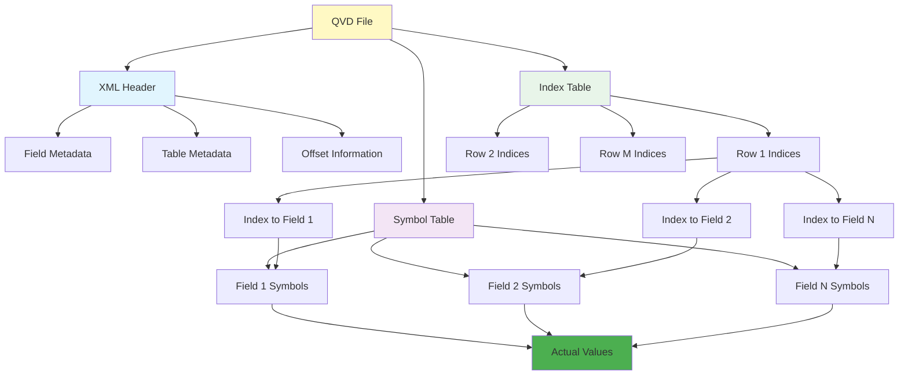
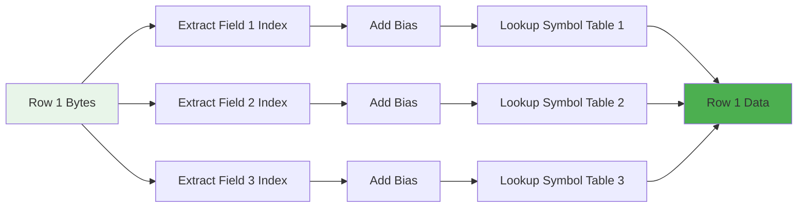

# QVD File Format Specification

## ⚠️ Important Disclaimer

**This library is based on reverse engineering of the QVD file format**, as the format is not publicly documented by Qlik. While extensive effort has been made to understand and implement the format correctly, there may be incorrect assumptions or interpretations of the file structure.

**Comprehensive testing has been performed** to ensure that QVD files created or modified by qvdjs are valid and can be loaded by Qlik Sense and QlikView without errors. However, users should:

- Test thoroughly with their specific use cases
- Validate output files in their Qlik environment
- Report any issues or inconsistencies discovered

The library works with real-world QVD files and maintains compatibility with Qlik products, but it is an independent, community-driven implementation.

---

This document provides a comprehensive specification of the QVD (QlikView Data) file format. Understanding this format is essential for working with the qvdjs library internals or implementing QVD support in other tools.

## Table of Contents

- [QVD File Format Specification](#qvd-file-format-specification)
  - [⚠️ Important Disclaimer](#️-important-disclaimer)
  - [Table of Contents](#table-of-contents)
  - [Overview](#overview)
    - [Key Characteristics](#key-characteristics)
    - [Design Goals](#design-goals)
  - [File Structure](#file-structure)
    - [Visual Data Flow](#visual-data-flow)
  - [XML Header Section](#xml-header-section)
    - [Complete Header Structure](#complete-header-structure)
    - [Header Field Descriptions](#header-field-descriptions)
      - [Top-Level Elements](#top-level-elements)
      - [QvdFieldHeader Elements](#qvdfieldheader-elements)
      - [NumberFormat Structure](#numberformat-structure)
  - [Symbol Table Section](#symbol-table-section)
    - [Structure](#structure)
    - [Symbol Type Encodings](#symbol-type-encodings)
    - [Detailed Type Specifications](#detailed-type-specifications)
      - [Type 1: Pure Integer](#type-1-pure-integer)
      - [Type 2: Pure Double](#type-2-pure-double)
      - [Type 4: Pure String](#type-4-pure-string)
      - [Type 5: Dual Integer](#type-5-dual-integer)
      - [Type 6: Dual Double](#type-6-dual-double)
    - [Symbol Table Example](#symbol-table-example)
  - [Index Table Section](#index-table-section)
    - [Bit Packing Concept](#bit-packing-concept)
    - [Row Structure](#row-structure)
      - [Example: 3 Fields](#example-3-fields)
      - [Example: Bit Widths Don't Align to Bytes](#example-bit-widths-dont-align-to-bytes)
    - [Index Calculation with Bias](#index-calculation-with-bias)
    - [Index Table Visual](#index-table-visual)
  - [Data Type Mappings](#data-type-mappings)
    - [QVD Types to JavaScript Types](#qvd-types-to-javascript-types)
    - [Type Selection Strategy](#type-selection-strategy)
    - [Qlik Number Format Types](#qlik-number-format-types)
  - [Bit Packing Algorithm](#bit-packing-algorithm)
    - [Writing Bit-Packed Values](#writing-bit-packed-values)
    - [Reading Bit-Packed Values](#reading-bit-packed-values)
  - [Empty QVD Files](#empty-qvd-files)
    - [Characteristics](#characteristics)
    - [Empty QVD Header Example](#empty-qvd-header-example)
    - [Use Cases](#use-cases)
  - [Encoding Details](#encoding-details)
    - [Character Encoding](#character-encoding)
    - [Byte Order](#byte-order)
    - [String Termination](#string-termination)
    - [Special Values](#special-values)
  - [Example Breakdown](#example-breakdown)
    - [Sample Data](#sample-data)
    - [Symbol Tables](#symbol-tables)
    - [Bit Width Calculation](#bit-width-calculation)
    - [Index Table](#index-table)
    - [Complete Binary Layout](#complete-binary-layout)
  - [Implementation Notes](#implementation-notes)
    - [Performance Considerations](#performance-considerations)
    - [Possible Pitfalls](#possible-pitfalls)
    - [Validation Checks](#validation-checks)
    - [Security Considerations](#security-considerations)
  - [References](#references)
    - [Official Documentation](#official-documentation)
    - [Related Formats](#related-formats)
    - [Additional Resources](#additional-resources)

## Overview

QVD (QlikView Data) is a proprietary binary file format developed by Qlik for efficiently storing table data. Despite being proprietary, the format is well-documented and can be parsed without QlikView.

### Key Characteristics

- **Binary format** with human-readable XML header
- **Columnar storage** optimized for repeated values
- **Bit-packed indices** for space efficiency
- **No compression** (in basic implementation)
- **Little-endian** byte order throughout
- **Platform-independent** structure

### Design Goals

1. **Efficient storage**: Symbol tables eliminate value repetition
2. **Fast reading**: Sequential binary format, no random seeks
3. **Metadata rich**: Comprehensive field and table metadata
4. **Type preservation**: Supports dual types (numeric + string representation)

## File Structure

A QVD file consists of three sequential sections:

```text
┌─────────────────────────────────────────────────────────────┐
│                      XML Header                             │
│  • Field definitions (names, types, offsets)                │
│  • Table metadata (name, record count, timestamps)          │
│  • Format information (bit widths, offsets)                 │
│  • Terminated by: \r\n\0                                    │
├─────────────────────────────────────────────────────────────┤
│                    Symbol Table                             │
│  • Unique values for each column                            │
│  • Type byte prefix + value encoding                        │
│  • One section per field (Field1, Field2, ..., FieldN)      │
│  • Variable length per field                                │
├─────────────────────────────────────────────────────────────┤
│                     Index Table                             │
│  • Bit-packed indices referencing symbol table              │
│  • One "row" per record                                     │
│  • Fixed byte size per row (RecordByteSize)                 │
│  • Total rows: NoOfRecords                                  │
└─────────────────────────────────────────────────────────────┘
```

### Visual Data Flow



## XML Header Section

The XML header contains all metadata about the QVD file. It is encoded in UTF-8 and terminated by the delimiter `\r\n\0` (carriage return, line feed, null byte).

### Complete Header Structure

```xml
<?xml version="1.0" encoding="UTF-8"?>
<QvdTableHeader>
  <!-- Build Information -->
  <QvBuildNo>50834</QvBuildNo>

  <!-- Document Information -->
  <CreatorDoc>{AAAAAAAA-BBBB-CCCC-DDDD-EEEEEEEEEEEE}</CreatorDoc>

  <!-- Timestamps (ISO 8601 format) -->
  <CreateUtcTime>2024-01-15 10:30:45</CreateUtcTime>
  <SourceCreateUtcTime>2024-01-15 09:00:00</SourceCreateUtcTime>
  <SourceFileUtcTime>2024-01-15 09:00:00</SourceFileUtcTime>
  <StaleUtcTime>2024-01-20 00:00:00</StaleUtcTime>

  <!-- Source Information -->
  <SourceFileSize>12345678</SourceFileSize>

  <!-- Table Information -->
  <TableName>Products</TableName>
  <Comment>Product master data table</Comment>

  <!-- Field Definitions -->
  <Fields>
    <QvdFieldHeader>
      <FieldName>ProductKey</FieldName>
      <BitOffset>0</BitOffset>
      <BitWidth>13</BitWidth>
      <Bias>0</Bias>
      <NoOfSymbols>5678</NoOfSymbols>
      <Offset>0</Offset>
      <Length>28390</Length>
      <Comment>Unique product identifier</Comment>
      <NumberFormat>
        <Type>INTEGER</Type>
        <nDec>0</nDec>
        <UseThou>0</UseThou>
        <Fmt></Fmt>
        <Dec>.</Dec>
        <Thou>,</Thou>
      </NumberFormat>
      <Tags>
        <String>$numeric</String>
        <String>$integer</String>
        <String>$key</String>
      </Tags>
    </QvdFieldHeader>

    <QvdFieldHeader>
      <FieldName>ProductName</FieldName>
      <BitOffset>13</BitOffset>
      <BitWidth>12</BitWidth>
      <Bias>0</Bias>
      <NoOfSymbols>3456</NoOfSymbols>
      <Offset>28390</Offset>
      <Length>45678</Length>
      <Comment>Product display name</Comment>
      <NumberFormat>
        <Type>UNKNOWN</Type>
        <nDec>0</nDec>
        <UseThou>0</UseThou>
      </NumberFormat>
      <Tags>
        <String>$text</String>
      </Tags>
    </QvdFieldHeader>

    <!-- Additional fields... -->
  </Fields>

  <!-- Index Table Metadata -->
  <RecordByteSize>4</RecordByteSize>
  <NoOfRecords>123456</NoOfRecords>
  <Offset>74068</Offset>
  <Length>493824</Length>

  <!-- Optional: Compression -->
  <Compression></Compression>

  <!-- Optional: Encryption -->
  <EncryptionInfo></EncryptionInfo>

  <!-- Optional: Table Tags -->
  <TableTags>
    <String>$hidden</String>
  </TableTags>

  <!-- Optional: Lineage (data source tracking) -->
  <Lineage>
    <LineageInfo>
      <Discriminator>LOAD</Discriminator>
      <Statement>LOAD * FROM Products.csv</Statement>
    </LineageInfo>
  </Lineage>
</QvdTableHeader>
\r\n\0
```

### Header Field Descriptions

#### Top-Level Elements

| Element               | Type      | Description                                 | Required |
| --------------------- | --------- | ------------------------------------------- | -------- |
| `QvBuildNo`           | Integer   | QlikView build number that created the file | Yes      |
| `CreatorDoc`          | GUID      | Document ID that created this QVD           | No       |
| `CreateUtcTime`       | DateTime  | When the QVD was created (UTC)              | Yes      |
| `SourceCreateUtcTime` | DateTime  | When the source data was created            | No       |
| `SourceFileUtcTime`   | DateTime  | Source file timestamp                       | No       |
| `SourceFileSize`      | Integer   | Source file size in bytes                   | No       |
| `StaleUtcTime`        | DateTime  | When data becomes stale                     | No       |
| `TableName`           | String    | Name of the table                           | Yes      |
| `Comment`             | String    | Table description                           | No       |
| `Fields`              | Container | Field definitions                           | Yes      |
| `RecordByteSize`      | Integer   | Bytes per row in index table                | Yes      |
| `NoOfRecords`         | Integer   | Total number of data records                | Yes      |
| `Offset`              | Integer   | Byte offset to index table                  | Yes      |
| `Length`              | Integer   | Byte length of index table                  | Yes      |
| `Compression`         | String    | Compression method (empty = none)           | No       |
| `EncryptionInfo`      | String    | Encryption details                          | No       |
| `TableTags`           | Array     | Table-level tags                            | No       |
| `Lineage`             | Container | Data source lineage information             | No       |

#### QvdFieldHeader Elements

| Element        | Type    | Description                           | Required |
| -------------- | ------- | ------------------------------------- | -------- |
| `FieldName`    | String  | Column name                           | Yes      |
| `BitOffset`    | Integer | Bit offset within row                 | Yes      |
| `BitWidth`     | Integer | Number of bits for this field's index | Yes      |
| `Bias`         | Integer | Offset applied to stored index value  | Yes      |
| `NoOfSymbols`  | Integer | Count of unique values                | Yes      |
| `Offset`       | Integer | Byte offset to symbol section         | Yes      |
| `Length`       | Integer | Byte length of symbol section         | Yes      |
| `Comment`      | String  | Field description                     | No       |
| `NumberFormat` | Object  | Number formatting rules               | No       |
| `Tags`         | Array   | Field classification tags             | No       |

#### NumberFormat Structure

| Element   | Description             | Example                                                            |
| --------- | ----------------------- | ------------------------------------------------------------------ |
| `Type`    | Format type             | `INTEGER`, `REAL`, `MONEY`, `DATE`, `TIME`, `TIMESTAMP`, `UNKNOWN` |
| `nDec`    | Decimal places          | `2`                                                                |
| `UseThou` | Use thousands separator | `1` (yes) or `0` (no)                                              |
| `Fmt`     | Custom format string    | `#,##0.00`                                                         |
| `Dec`     | Decimal separator       | `.` or `,`                                                         |
| `Thou`    | Thousands separator     | `,` or `.` or ` `                                                  |

## Symbol Table Section

The symbol table stores unique values for each field. It begins immediately after the XML header delimiter (`\r\n\0`).

### Structure

```text
┌─────────────────────────────────────────┐
│  Field 1 Symbol Section                 │
│  ├─ Symbol 1: [Type Byte][Value]        │
│  ├─ Symbol 2: [Type Byte][Value]        │
│  └─ Symbol N: [Type Byte][Value]        │
├─────────────────────────────────────────┤
│  Field 2 Symbol Section                 │
│  ├─ Symbol 1: [Type Byte][Value]        │
│  ├─ Symbol 2: [Type Byte][Value]        │
│  └─ Symbol N: [Type Byte][Value]        │
├─────────────────────────────────────────┤
│  ...                                    │
└─────────────────────────────────────────┘
```

### Symbol Type Encodings

Each symbol begins with a type byte that determines how to parse the value:

| Type Byte | Type Name    | Binary Format                                | Example             |
| --------- | ------------ | -------------------------------------------- | ------------------- |
| `0x01`    | Pure Integer | `[0x01][4-byte LE int]`                      | `42`                |
| `0x02`    | Pure Double  | `[0x02][8-byte LE double]`                   | `3.14159`           |
| `0x04`    | Pure String  | `[0x04][null-term string]`                   | `"Hello"`           |
| `0x05`    | Dual Integer | `[0x05][4-byte LE int][null-term string]`    | `100` + `"100"`     |
| `0x06`    | Dual Double  | `[0x06][8-byte LE double][null-term string]` | `99.5` + `"$99.50"` |

### Detailed Type Specifications

#### Type 1: Pure Integer

```text
Byte Layout:
┌──────┬────────┬────────┬────────┬────────┐
│ 0x01 │ Byte 0 │ Byte 1 │ Byte 2 │ Byte 3 │
└──────┴────────┴────────┴────────┴────────┘
         └────── 32-bit signed integer (LE) ──────┘

Example: 42
Hex: 01 2A 00 00 00
```

#### Type 2: Pure Double

```text
Byte Layout:
┌──────┬────────┬────────┬───┬────────┬────────┐
│ 0x02 │ Byte 0 │ Byte 1 │...│ Byte 6 │ Byte 7 │
└──────┴────────┴────────┴───┴────────┴────────┘
         └──── 64-bit IEEE 754 double (LE) ────┘

Example: 3.14159
Hex: 02 6E 86 1B F0 F9 21 09 40
```

#### Type 4: Pure String

```text
Byte Layout:
┌──────┬────────┬────────┬───┬────────┬──────┐
│ 0x04 │ Char 1 │ Char 2 │...│ Char N │ 0x00 │
└──────┴────────┴────────┴───┴────────┴──────┘
         └──────── UTF-8 encoded string ──────┘

Example: "Hello"
Hex: 04 48 65 6C 6C 6F 00
```

#### Type 5: Dual Integer

```text
Byte Layout:
┌──────┬───────────────┬────────┬───┬────────┬──────┐
│ 0x05 │ 4-byte int LE │ Char 1 │...│ Char N │ 0x00 │
└──────┴───────────────┴────────┴───┴────────┴──────┘

Example: 100 + "100"
Hex: 05 64 00 00 00 31 30 30 00
```

#### Type 6: Dual Double

```text
Byte Layout:
┌──────┬──────────────┬────────┬───┬────────┬──────┐
│ 0x06 │ 8-byte dbl LE│ Char 1 │...│ Char N │ 0x00 │
└──────┴──────────────┴────────┴───┴────────┴──────┘

Example: 99.50 + "$99.50"
Hex: 06 00 00 00 00 00 E6 58 40 24 39 39 2E 35 30 00
```

### Symbol Table Example

For a field with values: `[42, 100, 42, 200, 100]`

Symbol table contains unique values only:

```text
Symbol 0: [0x01][0x2A 0x00 0x00 0x00]       // 42
Symbol 1: [0x01][0x64 0x00 0x00 0x00]       // 100
Symbol 2: [0x01][0xC8 0x00 0x00 0x00]       // 200
```

Index table contains references:

```text
Row 0: Index 0 → Symbol 0 → 42
Row 1: Index 1 → Symbol 1 → 100
Row 2: Index 0 → Symbol 0 → 42
Row 3: Index 2 → Symbol 2 → 200
Row 4: Index 1 → Symbol 1 → 100
```

## Index Table Section

The index table contains bit-packed indices that reference symbols in the symbol table. It begins immediately after the symbol table.

### Bit Packing Concept

Instead of using full bytes for indices, QVD uses only the minimum number of bits required:

```text
For 5 unique symbols: Need ceil(log2(5)) = 3 bits per index
For 100 unique symbols: Need ceil(log2(100)) = 7 bits per index
For 1000 unique symbols: Need ceil(log2(1000)) = 10 bits per index
```

This significantly reduces file size for columns with many repeated values.

### Row Structure

Each row in the index table is `RecordByteSize` bytes. Fields are packed sequentially based on `BitOffset` and `BitWidth`.

#### Example: 3 Fields

```text
Field 1: BitOffset=0,  BitWidth=8
Field 2: BitOffset=8,  BitWidth=8
Field 3: BitOffset=16, BitWidth=8

RecordByteSize = ceil((0+8 + 8+8 + 16+8) / 8) = 3 bytes per row

Row bytes:
┌──────────────────┬──────────────────┬──────────────────┐
│ Byte 0: Field 1  │ Byte 1: Field 2  │ Byte 2: Field 3  │
└──────────────────┴──────────────────┴──────────────────┘
```

#### Example: Bit Widths Don't Align to Bytes

```text
Field 1: BitOffset=0,  BitWidth=5  (bits 0-4)
Field 2: BitOffset=5,  BitWidth=6  (bits 5-10)
Field 3: BitOffset=11, BitWidth=7  (bits 11-17)

Total bits per row: 18
RecordByteSize = ceil(18 / 8) = 3 bytes per row

Bit layout within 3 bytes:
┌──────────────────────────────────────────────────────────────┐
│ Byte 0          │ Byte 1          │ Byte 2          │
│ 76543210        │ 76543210        │ 76543210        │
├─────────────────┼─────────────────┼─────────────────┤
│ ─FFFFF─         │ ──SSSSFF        │ ────TTTS        │
│  Field1         │   Field2        │    Field3       │
└──────────────────────────────────────────────────────────────┘

Reading Field 2 (bits 5-10):
1. Read bytes 0-1 as 16-bit value
2. Shift right by 5 bits
3. Mask to get 6 bits: & 0x3F
```

### Index Calculation with Bias

The actual index is calculated as:

```text
actualIndex = storedValue + Bias
```

`Bias` is typically 0 but can be used for optimization in certain scenarios.

### Index Table Visual



## Data Type Mappings

### QVD Types to JavaScript Types

| QVD Type     | Type Byte | JavaScript Type | Notes                 |
| ------------ | --------- | --------------- | --------------------- |
| Pure Integer | 0x01      | `number`        | 32-bit signed integer |
| Pure Double  | 0x02      | `number`        | IEEE 754 double       |
| Pure String  | 0x04      | `string`        | UTF-8 encoded         |
| Dual Integer | 0x05      | `number`        | Prefers numeric value |
| Dual Double  | 0x06      | `number`        | Prefers numeric value |

### Type Selection Strategy

When writing data, qvdjs uses this logic:

```javascript
// Conceptual example of type selection logic
// Note: The actual implementation in QvdFileWriter._convertRawToSymbol may differ
function determineSymbolType(value) {
  if (value === null || value === undefined) {
    return createStringSymbol(""); // Empty string
  }

  if (typeof value === "number") {
    if (
      Number.isInteger(value) &&
      value >= -2147483648 &&
      value <= 2147483647
    ) {
      return createIntegerSymbol(value);
    } else {
      return createDoubleSymbol(value);
    }
  }

  if (typeof value === "string") {
    // Check if string represents a number
    const num = Number(value);
    if (!isNaN(num)) {
      if (Number.isInteger(num)) {
        return createDualIntegerSymbol(num, value);
      } else {
        return createDualDoubleSymbol(num, value);
      }
    }
    return createStringSymbol(value);
  }

  // Fallback: convert to string
  return createStringSymbol(String(value));
}
```

### Qlik Number Format Types

These appear in the `NumberFormat/Type` element:

| Type        | Description        | Example               |
| ----------- | ------------------ | --------------------- |
| `INTEGER`   | Whole numbers      | `42`, `-100`          |
| `REAL`      | Floating point     | `3.14159`             |
| `MONEY`     | Currency           | `$99.50`              |
| `DATE`      | Date values        | `2024-01-15`          |
| `TIME`      | Time values        | `14:30:00`            |
| `TIMESTAMP` | Date + time        | `2024-01-15 14:30:00` |
| `UNKNOWN`   | No specific format | (default)             |

## Bit Packing Algorithm

These are conceptual examples showing how bit-packing works in QVD files. The actual implementation in qvdjs may differ but follows the same principles.

### Writing Bit-Packed Values

```javascript
// Conceptual example of bit-packing algorithm
function writeBitPackedRow(buffer, offset, indices, bitWidths, bitOffsets) {
  for (let i = 0; i < indices.length; i++) {
    const index = indices[i];
    const bitWidth = bitWidths[i];
    const bitOffset = bitOffsets[i];

    const byteOffset = Math.floor(bitOffset / 8);
    const bitPosition = bitOffset % 8;

    // Write the value spanning potentially multiple bytes
    let remainingBits = bitWidth;
    let value = index;
    let currentByte = byteOffset + offset;

    while (remainingBits > 0) {
      const bitsInThisByte = Math.min(8 - bitPosition, remainingBits);
      const mask = (1 << bitsInThisByte) - 1;
      const valueBits = value & mask;

      // Read existing byte, set bits, write back
      let existingByte = buffer[currentByte] || 0;
      existingByte |= valueBits << bitPosition;
      buffer[currentByte] = existingByte;

      value >>= bitsInThisByte;
      remainingBits -= bitsInThisByte;
      currentByte++;
      bitPosition = 0; // After first byte, always start at bit 0
    }
  }
}
```

### Reading Bit-Packed Values

```javascript
// Conceptual example of bit-unpacking algorithm
function readBitPackedRow(buffer, offset, bitWidths, bitOffsets) {
  const indices = [];

  for (let i = 0; i < bitWidths.length; i++) {
    const bitWidth = bitWidths[i];
    const bitOffset = bitOffsets[i];

    const byteOffset = Math.floor(bitOffset / 8);
    const bitPosition = bitOffset % 8;

    // Read value spanning potentially multiple bytes
    let value = 0;
    let bitsRead = 0;
    let currentByte = byteOffset + offset;

    while (bitsRead < bitWidth) {
      const bitsInThisByte = Math.min(8 - bitPosition, bitWidth - bitsRead);
      const mask = ((1 << bitsInThisByte) - 1) << bitPosition;

      const byteBits = (buffer[currentByte] & mask) >> bitPosition;
      value |= byteBits << bitsRead;

      bitsRead += bitsInThisByte;
      currentByte++;
      bitPosition = 0;
    }

    indices.push(value);
  }

  return indices;
}
```

## Empty QVD Files

QVD files can have zero data rows while preserving field structure.

### Characteristics

- `NoOfRecords` = 0
- `RecordByteSize` = 1 (Qlik convention)
- Fields defined with metadata
- Each field has `NoOfSymbols` = 0, `Offset` = 0, `Length` = 0
- `BitWidth` can vary (typically 0 or 8)
- Index table has `Length` = 0

### Empty QVD Header Example

```xml
<QvdTableHeader>
  <TableName>EmptyTable</TableName>
  <Fields>
    <QvdFieldHeader>
      <FieldName>ProductKey</FieldName>
      <BitOffset>0</BitOffset>
      <BitWidth>0</BitWidth>
      <Bias>0</Bias>
      <NoOfSymbols>0</NoOfSymbols>
      <Offset>0</Offset>
      <Length>0</Length>
    </QvdFieldHeader>
  </Fields>
  <RecordByteSize>1</RecordByteSize>
  <NoOfRecords>0</NoOfRecords>
  <Offset>0</Offset>
  <Length>0</Length>
</QvdTableHeader>
```

### Use Cases

- Template tables with schema but no data
- Incremental loading placeholders
- Data pipeline initialization

## Encoding Details

### Character Encoding

- **XML Header**: UTF-8
- **String Values**: UTF-8
- **Field Names**: UTF-8

### Byte Order

- **All numeric values**: Little-endian
- **Integers**: 32-bit signed, little-endian
- **Doubles**: IEEE 754, little-endian

### String Termination

- All strings in symbol table are null-terminated (`\0`)
- Length is not prefixed - read until null byte
- Empty strings are encoded as a single null byte

### Special Values

| Value        | Representation                                    |
| ------------ | ------------------------------------------------- |
| `null`       | Empty string symbol (type 0x04, single null byte) |
| `undefined`  | Empty string symbol                               |
| Empty string | Type 0x04, single null byte                       |
| `0`          | Type 0x01, four zero bytes                        |
| `0.0`        | Type 0x02, eight bytes (0x00 in IEEE 754)         |

## Example Breakdown

Let's walk through a complete minimal QVD file.

### Sample Data

| ID  | Name  |
| --- | ----- |
| 1   | Alice |
| 2   | Bob   |
| 1   | Alice |

### Symbol Tables

**Field: ID**

```text
Symbol 0: [0x01][0x01 0x00 0x00 0x00]  // 1
Symbol 1: [0x01][0x02 0x00 0x00 0x00]  // 2
```

**Field: Name**

```text
Symbol 0: [0x04][0x41 0x6C 0x69 0x63 0x65 0x00]  // "Alice"
Symbol 1: [0x04][0x42 0x6F 0x62 0x00]            // "Bob"
```

### Bit Width Calculation

- **ID**: 2 unique symbols → ceil(log2(2)) = 1 bit
- **Name**: 2 unique symbols → ceil(log2(2)) = 1 bit
- **Total**: 2 bits per row
- **RecordByteSize**: ceil(2 / 8) = 1 byte per row

### Index Table

```text
Row 0: ID=0, Name=0  →  Binary: 00000000 (0x00)
Row 1: ID=1, Name=1  →  Binary: 00000011 (0x03)
Row 2: ID=0, Name=0  →  Binary: 00000000 (0x00)
```

### Complete Binary Layout

```text
[XML Header...]
\r\n\0

[Symbol Table - Field 1 (ID)]
01 01 00 00 00         // Symbol 0: 1
01 02 00 00 00         // Symbol 1: 2

[Symbol Table - Field 2 (Name)]
04 41 6C 69 63 65 00   // Symbol 0: "Alice"
04 42 6F 62 00         // Symbol 1: "Bob"

[Index Table]
00                     // Row 0: [0, 0]
03                     // Row 1: [1, 1]
00                     // Row 2: [0, 0]
```

## Implementation Notes

### Performance Considerations

1. **Sequential Reading**: QVD format is optimized for sequential reads
2. **Symbol Table Caching**: Keep symbol tables in memory for fast lookups
3. **Bit Unpacking**: Use bit manipulation, not string operations
4. **Buffer Pre-allocation**: Allocate buffers with known sizes upfront

### Possible Pitfalls

1. **Byte Order**: Always use little-endian (`readInt32LE`, not `readInt32BE`)
2. **String Termination**: Don't forget null terminator when writing strings
3. **Bit Alignment**: BitOffset is cumulative across all fields in a row
4. **Empty Symbols**: Handle empty string symbols correctly (single null byte)
5. **Bias**: Remember to add bias to stored index values

### Validation Checks

When parsing QVD files, validate:

```javascript
// Header validation
assert(header.NoOfRecords >= 0, "Invalid record count");
assert(
  header.RecordByteSize > 0 || header.NoOfRecords === 0,
  "Invalid byte size"
);

// Field validation
for (const field of fields) {
  assert(field.NoOfSymbols >= 0, "Invalid symbol count");
  assert(field.BitWidth >= 0, "Invalid bit width");
  assert(field.Length >= 0, "Invalid length");
}

// Buffer bounds
assert(offset + length <= buffer.length, "Read beyond buffer");

// Symbol type
assert([1, 2, 4, 5, 6].includes(typeByte), "Unknown symbol type");
```

### Security Considerations

- **Buffer Overflow**: Always validate offsets and lengths before reading
- **Infinite Loops**: Set maximum iterations when reading null-terminated strings
- **Memory Exhaustion**: Validate `NoOfSymbols` and `NoOfRecords` are reasonable
- **Path Traversal**: Validate all file paths before operations

## References

### Official Documentation

While QVD is proprietary, the format has been documented by the community:

- **Qlik Community**: Various forum posts and discussions
- **Open Source Implementations**: Several parsers exist in different languages
- **Reverse Engineering**: Format has been extensively reverse-engineered

### Related Formats

- **Parquet**: Similar columnar storage, but with different compression
- **ORC**: Optimized Row Columnar format
- **Avro**: Schema-based binary format

### Additional Resources

- **IEEE 754**: Floating point number format
- **Little Endian**: Byte order explanation
- **Bit Manipulation**: Techniques for bit packing/unpacking

---

For questions about the QVD format or implementation, please open a GitHub discussion.
